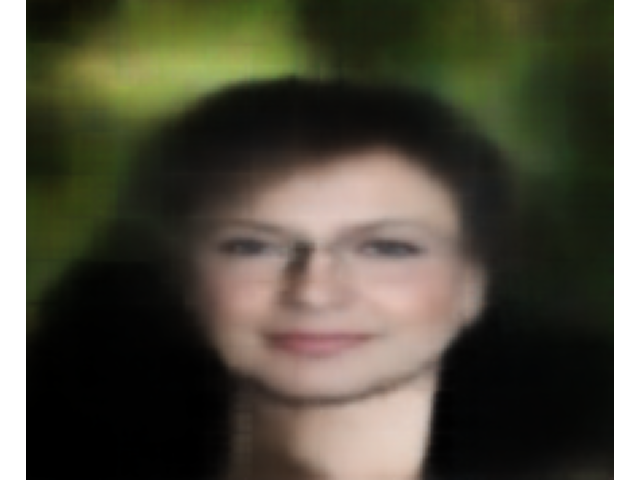

# CVAE-FaceImageGenerator

核心功能仅使用`numpy`实现的条件卷积变分自编码器（CVAE）人脸图像生成模型。

[English docs](./README_EN.md)

## 特点

- **高度轻量化**: DecoderOnly且fp16量化之后大小仅有1.7MB
- 使用numpy实现高度类似Pytorch的接口
- 支持使用彩色字符显示图像(ASCII Art)



## 依赖
- **numpy**
- **matplotlib**
- **PyTorch**（可选，仅用于训练模型）
- **torchvision**（可选，用于处理训练期间的CelebA数据集）

## 安装
1. 克隆仓库并初始化子模块：
   ```bash
   git clone --recurse-submodules https://github.com/hammershock/CVAEGenerator.git
   cd CVAEGenerator
   ```

2. 使用pip安装所需的软件包：
   ```bash
   pip install numpy matplotlib
   pip install torch torchvision  # 仅用于训练
   ```

## 使用方法

- 运行 `main.py` 进行推理，使用预训练模型生成人脸图像
- 训练模型 `train.py` 

## 数据集

该项目使用[CelebA数据集](https://mmlab.ie.cuhk.edu.hk/projects/CelebA.html)。

- 模型将图像属性集成到其架构中，使其能够生成有条件的人脸图像。
- 该系统支持加载预训练权重和使用PyTorch从头开始训练。
